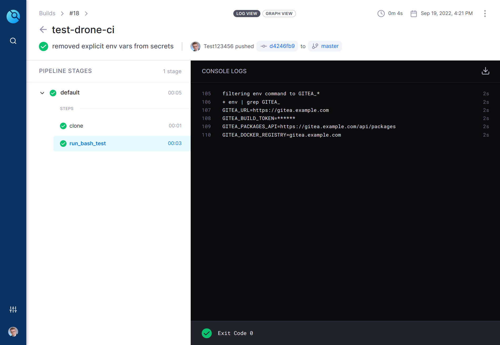

# Drone Gitea Secret Extension

An extension to improve Gitea/Drone integration, creating a temporary per-pipeline access tokens with access scoped to
the owner of the build job and injecting it as environment variables into the build.



## Installation

### Create a shared secret:

```bash
openssl rand -hex 16
```

### Download and run the plugin via docker:

```console
$ docker run -d \
  -p 3000:3000 \
  --env=DRONE_DEBUG=true \
  --env=DRONE_SECRET=<shared-secret> \
  --restart=always \
  --name=drone-gitea-extensions \
  ghcr.io/davidhiendl/drone-gitea-extensions:master
```

### Deploy the plugin to Kubernetes via Helm:

See folder [./charts](./charts)

### Multiple Plugins at once

The environment, secret and registry plugin can be used concurrently. Simply add all the relevant environment variables
to the agent.

## Environment Plugin Configuration

Automatically injects environment variables into the build. Requires less boilerplate than the secret plugin alternative
but creates a token and injects the environment variables into every build regardless if it is needed.

| Key | Value | Example |
|-----------------------|--|---------|
| GITEA_URL | A URL pointing to the Gitea instance. | https://gitea.example.com         |
| GITEA_BUILD_TOKEN | A Gitea API token for API, packages and docker registry access. | xxxxxxxxxxxxxxxx |
| GITEA_PACKAGES_API | A URL pointing to the Gitea packages endpoint. | https://gitea.example.com/api/packages        |
| GITEA_DOCKER_REGISTRY | A hostname for the Gitea docker registry. | gitea.example.com |

Update your runner configuration to include the plugin address and the shared secret as environment variable:

```bash
DRONE_ENV_PLUGIN_ENDPOINT=http://1.2.3.4:3000/env
DRONE_ENV_PLUGIN_TOKEN==<shared-secret>
```

Use in pipelines:

```yaml
kind: pipeline
name: default

steps:
  - name: build
    image: alpine
    commands:
      - echo "running env command"
      - env
      - echo "filtering env to GITEA_*"
      - env | grep GITEA_
```

## Registry Plugin Configuration

Automatically injects the Gitea registry into the build allowing the use of images in the gitea registry for pipeline
steps.

Update your runner configuration to include the plugin address and the shared secret as environment variable:

```bash
DRONE_REGISTRY_PLUGIN_ENDPOINT=http://1.2.3.4:3000/registry
DRONE_REGISTRY_PLUGIN_TOKEN==<shared-secret>
```

Use in pipelines: No Additional steps required, just reference the image.

```yaml
kind: pipeline
name: default

steps:
  - name: build
    image: gitea.example.com/<owner>/<image>:<tag>
```

## Secret Plugin Configuration

Update your runner configuration to include the plugin address and the shared secret as environment variable:

```bash
DRONE_SECRET_PLUGIN_ENDPOINT=http://1.2.3.4:3000/secret
DRONE_SECRET_PLUGIN_TOKEN=<shared-secret>
```

Use in pipelines:

```yaml
kind: pipeline
name: default

steps:
  - name: build
    image: alpine
    environment:
      GITEA_URL:
        from_secret: gitea_url
      GITEA_TOKEN:
        from_secret: gitea_build_token
      GITEA_PACKAGES_URL:
        from_secret: gitea_packages_url
      GITEA_DOCKER_REGISTRY:
        from_secret: gitea_docker_registry
    commands:
      - echo "running env command"
      - env
      - echo "filtering env to GITEA_*"
      - env | grep GITEA_

---
kind: secret
name: gitea_url
get:
  path: gitea
  name: url

---
kind: secret
name: gitea_build_token
get:
  path: gitea
  name: build_token

---
kind: secret
name: gitea_packages_url
get:
  path: gitea
  name: packages_url

---
kind: secret
name: gitea_docker_registry
get:
  path: gitea
  name: docker_registry
```

## Convert Plugin Configuration

Implements new directives for .drone-ci.yaml transformation

Update your drone server (IMPORTANT: this has to be added to the server, not the runners unlike the other plugins) configuration to include the plugin address and the shared secret as environment variable:

```bash
DRONE_CONVERT_PLUGIN_ENDPOINT=http://1.2.3.4:3000/convert
DRONE_CONVERT_PLUGIN_SECRET=<shared-secret>
```

### Directive _include

Allows including a remote YAML at the location of the directive.

Limitations: May only be at line start, no nested YAML keys are supported. This is due to how the directive is processed which is by text substituation in order to support all YAML features including anchors which would be difficult when parsing the YAML.

**Configuration**

| Config | Value | Default |
|-----------------------|--|---------|
| DRONE_CONFIG_INCLUDE_MAX | Number of include directives allow when processing a yaml file (including recursive includes) | 20 |

```bash
DRONE_CONFIG_INCLUDE_MAX=20
```

Use in pipelines:

**yaml to be included with _include**
```yaml
.StepTemplate: &StepTemplate
  image: alpine
  commands:
    - echo "do something"
```

**Project drone-ci.yaml**
```yaml
_include: https://yourdomain.tld/example.yaml

kind: pipeline
name: default

steps:
  - name: test
    <<: *StepTemplate
    image: ubuntu # overwrite
```

**Resulting merged yaml**
```yaml
# DIRECTIVE_START _include: https://yourdomain.tld/example.yaml
.StepTemplate: &StepTemplate
  image: alpine
  commands:
    - echo "do something"
_include: https://yourdomain.tld/example.yaml
  # DIRECTIVE_END _include: https://yourdomain.tld/example.yaml

kind: pipeline
name: default

steps:
  - name: test
    <<: *StepTemplate
    image: ubuntu # overwrite
```
